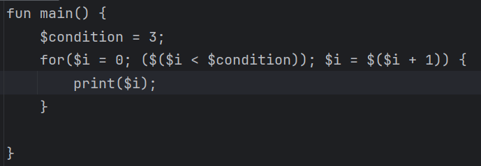
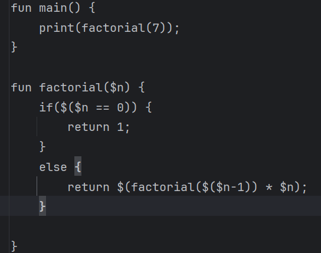

# Primeri uporabe
1. Program je prevajalnik domensko specifičnega programskega jezika, kar omeji možnosti uporabe, saj so vsi načini uporabe povezani z izrisom komponent na zemljevidu, vendar je jezik odlična alternativa jeziku geoJSON v teh pogledih
## 1.1. Precej krajša koda kot bi bila v programu napisanem v geoJSON
* **kaj uporabnik želi narediti:** uporabnik želi zapisati kodo v krajšem in berlivejšem formatu.
* **koraki izvedbe:** uporabnik uporablja zanke in funkcije da prepreči ponavljanje in boljše strukturira kodo
* **rezultat:** rezultat tega je berljivejše, bolje strukturirana in krajša koda. 

## 1.2. Možnost testiranja kode na vmesnih točkah
* **kaj uporabnik želi narediti:** uporabnik želi preveriti zakaj zapis ne izgleda kot pričakovan v primeru napak.
* **koraki izvedbe:** Uporabnik lahko sprotno izpisuje besedilo v konzolo s pomočjo integrirane funkcije print, ki sprejme niz.
* **rezultat:** Rezultat je sprotni izpis in preverjanje napak med tekom programa. 

## 1.3. Enostavnejši izris ponovljivih komponent - while in for zanke
* **kaj uporabnik želi narediti:** Uporabnik želi v manj vrsticah dodati ponovljive komponente, naprimer izmenjujoče ponovitve stena, okno
* **koraki izvedbe:** Uporabnik napiše primerno zanko in v njej reči enačbe
* **rezultat:** Rezultat izvedbe je krajša koda kot direkten zapis. 

## 1.4. Ni potrebe po računanju, saj ima programski jezik sam po sebi možnost računskih operacij
* **kaj uporabnik želi narediti:** želi imeti podan sistem enačb in z njimi v zanki ali v drugi funkciji izračunati relevantne komponente.
* **koraki izvedbe:** Uporabnik lahko uporablja bolj ali manj vse aritmetične enačbe, da izvede računske operacije
* **rezultat:** Krajša koda

***
2. Programski jezik ima različne funkcionalnosti implementirane:
## 2.1. Spremenljivke, računske operacije in izpis v konzolo
* **kaj uporabnik želi narediti:** Uporabnik želi računati z neznankami ali jih konkatenirati.
* **koraki izvedbe:** Uporabnik lahko shrani spremenljivke in računa z njimi ali z literali.
* **rezultat:** Poenostavljeno računanje.  

## 2.2. If stavki
* **kaj uporabnik želi narediti:** uporabnik želi uporabljati stavke glede na pogoje.
* **koraki izvedbe:** uporabnik preverja pogoje z if stavki.
* **rezultat:** pogojni stavki. 

## 2.3. for in while zanke
* **kaj uporabnik želi narediti:** uporabnik želi da bi uporabljal zanke.
* **koraki izvedbe:** zapis for in while zank.
* **rezultat:** Boljše strukturiranje kode. 
  
## 2.4. Funkcije in rekurzija
* **kaj uporabnik želi narediti:** uporabnik želi uporabljati funkcije za lepše strukturiranje kode
* **koraki izvedbe:** Zapis funkcije v obliki fun ime(argumenti_loceni_z_vejico) {telo}
* **rezultat:** Boljše strukturiranje kode. 

